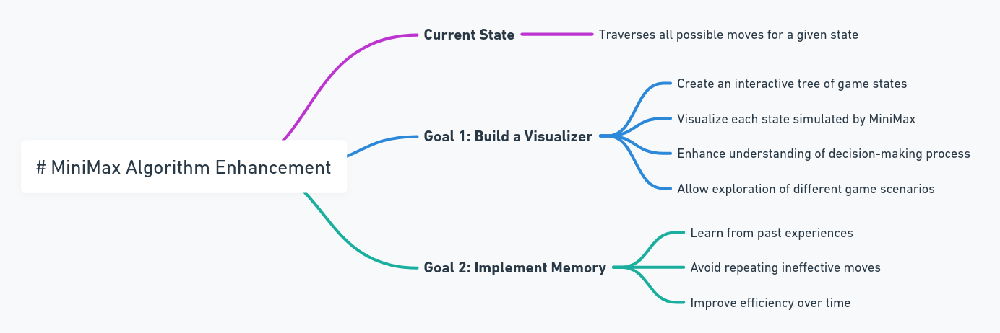
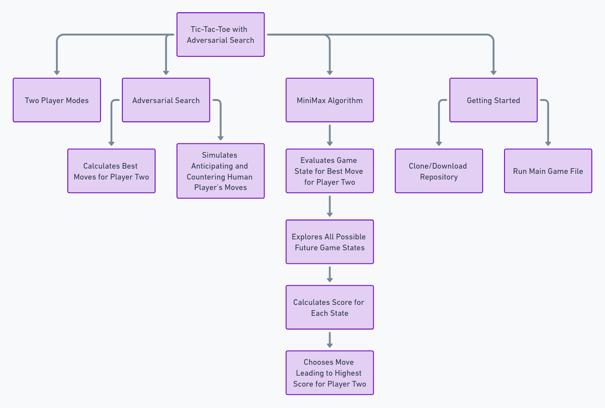
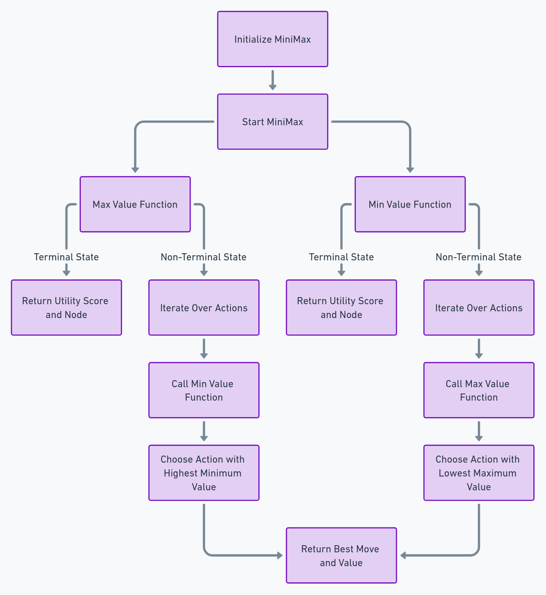

# Tic-Tac-Toe with Adversarial Search

## Current State and next steps: 

## Overview
This Tic-Tac-Toe game presents an enhanced challenge by incorporating advanced AI techniques for player two. Unlike traditional Tic-Tac-Toe games, this version employs adversarial search, specifically the MiniMax algorithm, to create a formidable opponent in player two (O), playing against player one (X).

## Features
- **Two Player Modes**: 
  - Player One (X) is controlled by a human player.
  - Player Two (O) is powered by an AI using the MiniMax algorithm.
- **Adversarial Search**: 
  - The game employs a sophisticated adversarial search technique to calculate the best moves for player two.
  - This approach simulates a player that anticipates and counters the human player's moves effectively.

## MiniMax Algorithm
The core of the AI player (player two) is the MiniMax algorithm. This algorithm explores all possible moves in the game, anticipating the opponent's responses to these moves. It then selects the move that maximizes the potential benefit while minimizing the potential losses, assuming the opponent is also playing optimally.

![mini-max algorith recursive tree illustrated](data:image/png;base64,iVBORw0KGgoAAAANSUhEUgAAAQIAAADDCAMAAABeUu/HAAABNVBMVEX///8aj//6+vr7+/u9vb3u7u7p6emlpaXz8/MAiv/Pz8/m5ubHx8fc3Nzg4OCcnJwAAACDg4NycnLW1tarq6t8fHy2trZPT0/KysqhoaEAh/+urq7BwcFkZGSTk5N0dHSMjIxlZWVaWlpKSkoAhf89PT05OTkuLi4jIyNUVFQAgf9LS0s0NDQREREfHx/++/XV5//x+P9Fnv96tv95otfm8f9xsf/I4P8+m/8kk/+Mvv3I2/Smyqne6+D79ez64N/tcmyUv5dbqf+ftdOLqtOvvc9Pk+K92Pyqzv8tje9mnN6iwOegyf4ojfHK4Pqjt89BkehtntrB2cNnp2nW5tebxJ+CtoZfm+FQme3L1uOSuOnxmJTrXVX1tbL2wsH98fHqTUP519bqTEL1u7nvhIDwi4a4zek3RGeUAAAVeUlEQVR4nO1diUPbxtJf67JuodPyIVkyGDBHzB0ggRASAskjaZK2SfvSlPZ93+v//ye8nZUtbOMbyXILv7ZUoNVo9NMes7MzK4Qe8YhHPOIRj3hEZqgsZK1B1mDFB08BxW9mrUL2ePC1AHEql7UKWYPm6axVeMQjsgUfdwNKlmpkBBcemoufvJKhKhmh7tjFTgoYzAL+JchQpRnDDRBa6aEAGVJVzU6lWUO0EVpGSBXbf8jDj4UH1RxCveH2UqArVSlDlWYOFgyiLgoqmBM7Q42ygeK2j7Qs1cgSt7WgmKUaGUCSGcbK5zVNt+0wNOr1+pOFhSf1eqhrlpm1cjOGFNeCB9sQXKd9ZGSpRiagqtgSlB40BUixtcrDrgXYDqqhB05BkVF0PDPIt36lFjPVJgvwZYRk6ZYCej1TdTJExWofFbJUIwOwimjKlQrD6EY5n8/7vh9sBoHv58uM/EAmShTP8izLcmwxkExFcV2XeSLLrmuqHMtnrdyMUW4bhfRqpnpkCAfPjkyLw/Wijn9TrAfkNEI8NghEMiJUDGVZIiOC6CmLD8mRrBG7AI8IBR7JGqKxoRRKyNSz1muWsBuIWIeeiooOsQ5tkTSMBwNV12TcD8iIrRshIt5zftGoZa3WDEHhx9YlpD46zqTYR+QMK/ZPw9b57TEVG0K3MQbba+eXM1Vo1tjaKb0aUUR5/b60uzUTbTLAh521vTHMH+7izdrR8X76+swcmIA3YvPOn5/2qfen4p6wtnO1PQOtZoinO0tvL077nBD6Tg6b6qu3S6Xzy39OFA4mQHjd91mPf7lbMSKcXnwVSsLB0xTVmh0uD0uld/0XSbbXfh18XVPcy5VKub9/54gJED5eDHjX528HVQIC3B4+CkLp6PjvzMLVUUnIvRoUW3i59q9RAvD4IBAW/p5DBH2dE3LCu4FzYFoosaOlnIqfQEzp8Ppvx8L2sYA1H9gGMM6Fr2NJamJ7Scj1sjC3Y2Zbsf0D3AJyudf9BkLAh0t0VRKejStW+uEjiOvsF47n1JJu6XW5AwQIXwcvlj9bOy7lhKGdYTdOcaeQIywIu+Qmx2tz2UlurV3jinCdK4Gy7/vaQi08A45+mUh40/1ESMAsLO1c7+8Kwjx2DkfCweX5UvS2Pg2dDzyDQocTVuamuZeLWIDKgH/OX3+wC7U/0vDtkG4QQCgQPk7qMcU941GLBMBRHwua9yeUOTHM+kAv59NSWzVhb/C6kKpDDwEUCHtDWsogNNUOEoSduwX01LM88tTKAEtnO34574dVAVsFHTEFRyMqykCor9vNISec954UnSfTSR0bPK9VB9gz5+1m+nVYL8AiHTymz5be3GPZQNmL68FuzynLWBBTnmAWNyr9V/6u2s3g0/DqraMFCqG/pmkEt2DjGrd03HWCMvkg5UwXXnTKfdv5/m1H8GGYAFb2GNyS+CkbQQtHeOKAm9Lbj18/7fUMC5yZcroTpShK31scCi1gDoZO8hXFpO6rxV97r364EGEtutm8H5cJYv+Hi4sL2RVF01TUMSY/90OG3iTqzsGsBUx6n8Sh3DmYtYChuA3RSEO8q4HUOGRWHFK0P6w8fT8BQ0EVy/inFPdSCYsHODZbV3ueoEoheeylsIIrLpPrTp4j9IUI4LCZaSRUY1dVx8MSOylwrWQDGhs8cv0eCuhaJRj3en4dIY8l131+/vIkEiD7dkIVFkITlntrQdEJk+yXDRNpTiuJCMBAq5MnsMZXSUYWD4lYP+J6EEmqJZWHwi0S8WbMKInne2INvmJy8I2winoowNR7Y9fjSqFRiSh4efL5cysdyawktayerxWUXgpCtsgkJL7zTu0DoAD/wk2YVYYpOPkJtwUaLpZk3MckGmbXRYGodOibHOJ5sjWdEcrFVTOVuCI5DtoI0hBPEClOUSivUtQUnTkLQxei8aU2mkrAcIiku6YomtLpZMXzJsM4ECurrfuGUfXWC4ubq6vr617VLzLj3IhzGaYM6UhBqGMBjUKhvrmyUVg3dM1KYARX29lOVdvG4tcLhY3NlXqhgMWXE7eR4upbnm64iWpBl6Qk4cZ8BskLh3eNrTsvmqHQSJuUXZoIUeMRwEtSu7ZWTNw7h8lPpZgikqpE8S88ev4T0iaNlq1ySJPTo6BGI1vtoACbhSc/I+pLkvco+2BsguJffsbD+sQUIMPHplVqFFAhOGW7KEA//ZwoA4hfgekAREc+/xH/mLghIGuZ6qQg6ThLku3U1RBaZmhi4GooXybpI88/oy8U8ielIG+hGouU2MefcCKKLtI1CjmxNYgJwa3gpyQ5ILMaojg27qiTySlwwbOZGgU0TDylbgpOKKJs0ogVn7wvILhtCKmkIzGdFCSKW9No07ex9eF53pN6wfMMe1LTqLoYYAGhF9YWCo3QsxM2jTxPx+I9LywsNGpeaAcpmEYrYNbyLMtXHQ7/nNgEFXUQAJlJqxwWkLSFbJVb4pVlNgXxBHESke4OKzYQcuwgSCUdKd+ehfH1NMQTLGLpQYAnuD4ehSk/mNRMhu7Q1a1IEjL1hCez0B06OoyM0BdU9EQj3B2V2N24E9uQ1BVERoRFhRv/XeKLTQYoMGvIzxNJ0iKdDxLSD8thTKDACVDoEgrkKrIT5SCUwBFXQ2yNOBKxaUTXYTOica+XDAU3AkVDvouoAtEx7xBvVyIQA9knI4LHIch7wsanrSAuTEh8hAXouj2SU/gkGhTx/1bGn4uQXU7xoIhfE3hdPfKaxMRcvD74p7F1GDjIj7KdinlkJZrtZHAGR7bdEWs13Ags/PqVmjf+iCZVYZol4W4g8MALCf2i5hlJTedcX/Qjr1E1DFA0F9e9RGfkTrQFWWzZOJN2hAHpC9i4cSacjoQf1jGRGEe4pZfsJrcPphsTO66Th5WaFrfrCKmIJ5jzZVU6blcpr9o+4hGPuD+ur1OWv4XQfrr5PFuIvs8Njt/i8XSrN1QuMdDnb/AUhn2fGs/72/TuUXPnevonOMiBTd38dJhOCPWW8JUE86m5g1TkI/r6kmJ3mofoaNowr52lyHpp7i1dJadXjOO1d61wRiV3mEaMdvPqcOeSUHA4OQUwZO8fLV20Zb1eO99GyS14bOFatX+49C4O6BQFEvuXMA+8efnUZM9Pr88vJ19Pw73UpSD8O+au+bokXCJ0J4Z4Shwc08cl4V1HSOuvQgm31z5x2vcCpShIUlRFnSJ4cud8t5T7pUPF5muhtHOdUGoJVcoJgvCmK6j3lSAcHawl3eeABYqffuy4CNNoz4a3SxA93uV3bn4SsN5RtzXdnk6yYbd8xtcQAv62O+ihuQfyj/tcN0v4DttqMlcQmNuTlXj6C9a7BK1Vt6tTSKcUqSBG9ZHEPvdmvp6+hz/jAz6f3bZZeb8dkXUO2hx2jwJbh6A4vKaVqjxNxA3r6tGLv4QYcOGoO81nG5JkciXcKdaY7DaPKnIL0aNRJGXn3UXnSfr1m/eQyojPrk75wZBaq1PawR3Bx0+vutd3+FdfjwRI2qCKm9WsopZZ027t3Ha5lPv6g9o7lDYl99U7bMjxQa06TS2gWpEeW2/3fjDZuwN1U73Y+7i2jZ6gzcxmz6ppRvT/+5UywJRochzi8SAzVUMQI4KpPo/fFn/q7rPOhpZ6cPxIjHgJVDorP23ppmo+tD307uCfsxvG3w7xWDx8J8e4GD9ZZZXuHExfKgWQh4m9uAMTdbqLceNqSXdfN8CbTcWlbrqKzwTSYgARFAzZuYs1EeRz4SO+R1d2MahT7WK8iCSVHFGjlHUbJNMxDqeoRL+o3VaBFRp+dOLs228vyAELWQqz6RdrHAlMwjctW5SHCAWMhryeu1cV5GikGJykCAWuTtIWhmKFbA14SwFQpjFsz9octgcXeSj1/Tu6OYuK28qs9lRc5yFOkQTEF2HdlIzezmZvt+xxCFbBoFgZPqingDelsjDyNT1BsDaL4ohuskIV9GwnTW8giO/Cpb7/jqizVnFvVvtuV2ryRhSsTxmwfCxCFTXKvQkSYsHdYKOAeXKSUGA4I5faNJuBNdQ4NgGCevmq1tN+DC0fklI3f/x59mdUXAn0WW2wKlWoSEePRr5IKAh5ZPUmSHAk9TdPTuYrhIIqh5xyH4ldUMjTdlFQg+/NdJeKwtJxqZvfb6IDaCu9rTFdxK/THUp9XMycLPIqvm5oqIp252CWiG8qDh3t4mLKZJ8Jia8bmoGUBQWUwjBMHkLgapqu67ZhGIsNzzBsXSs6tzMB+m6xQgEXq+p+cVi2Dm8yFSe6zm9dt+zViPj8bUNjRVKq2CpVNYxwwwMlAs2apYGgYXuPZyWJK1dUSRpoIsbFGGdYscHXBYoy+DpSisOldBVLnzxM8H6IA+yYoY08LuZOlusVu9r8IazRsR0w2+9SgSPDJ/E+N9++YWvA6W/CMiopZrffjAwV+fu3m1HiizSi8iTY/Obbd/x7EN1O7u5K8F8kBlHxk2PGODx25Gc0ItR4CEzCFPzx4s/fBlKAQhY+nme3TSag4OzPF/8ZJZ2v8TUKKLj54+b//j+iQPZ77T7VYDFJXRRgG9JJNHtzGBaIlYNeYAV/owdSgBaga+qi4A+E/vtilPTIIRmi37+RC0gAKIk46wLJpe2mYHbWIbb+sbGD1ukbrCB+qfkBSaO6aUAsY7tqgk2ES/82siWEEth9y+jFGbr5DbbIgUDWSk+EFUsCHdk4+6UBMzKrOKMvFpZNROFquUij38/OXgykgIk+ntdFwZ9nZ7+PEu+ziMOjPJ4EfD87u4kowHJ6vj6mw/4+HRQUKMTh/kGfqXUYpxxYQ6nvomACxDXfHmJ58be1YCLh9wP5CgjHSeyKapqmKMtuVa/IsmhKHNuv2KLZKqbbuJgLxYa4+uj2ddwC17quUWR6xVOtUpy5KOFSLi614kAppVuJdEDDPWVZZuRNx7IsbMZpDS/QtKLFVMQOyyQutlJuFavVfP9OsV5QEnlumaksVPB12P7TlqtYfN5iOkZFXiWlKhVrmWmV2tRxKavMyLP8EMVq+2VqQwPCF9uvpTxZaH68/mQMeSgubo0bWSymQFaeBO2UUCANarEFtnWSUMCNPaEHLwvxShIKBny+noMuQIHeps63j2YBqJAiDIqoGthBNCIEeErTvxjuDqOT0B0Wq/7IAHox+g93h42i50QjQk0z8ndLmWREWLbqZjQoLuYL00YOTwg1JL7DdcQ2iJsLU0AtR668TnAe+TZIjYcv5uCXBBTgV+uNciS7AdJFGBRdPXIkqkgx7qT6WGX4/gqmIO8gvkEGRbjbHQsqJUgbML4ZkOAJmmHrsB8FiK2DOWPTQAE+CdbhOBQgdwUqUEg+Wb1BrEOgoDe7I7/MEeuwGFFQjb5SlF7SUjecgOQDYDV9WyMpMwjP2u84b2XSNoL2SRGby37VH23D+n4xEr9YrGHaNExtQQt7rX87qBDp1Eq5rkQZChvWegobHvUDoyHTjvw0pJcijrO73aEcILB0tfZJ4jgbozv0K+R9wnVKy/mIj3qHezwDwwWjUjAYEK/RzLpDuA8VuTUJBjjOeoupYzrOqJ7r+g+5naUg5Goy0zMhxMM1N5T7uBg7md0WXze03pBSEOE495/m2k41MCylaN9ksZ9UCGY/NOdyz+hePEuTAirx+Ms0cDnZ3uCTYT9DCp7S9NV4d79OOla4A1vXSx8y2jm8eSw0j6/Gi9s/OJzmDk/Pm1c7I4P6/1rKLQ35JEuKeLp1etjcIQPSKFDHR7kpPpNEX42VGNB8L3zqLsNTSJ3B3Jm/vsQUnNOH49zrnSB0fz1I0kbacfuHl9J4uRH/KnXPpCsLqhMmlTA+BJwonu6yW+fX4xg8v5ZK3abLqjhysxNVVbmd0/Prg5HbarOvu37lJU8yuGGOluTAmqqijBX02PzlU9fv1Ko1MiiZ4iluS1UvpdH7Dvb4IvlQrUrhzMzFMYMef+2eRlCyuzxGA+JVip1m+2/PlOvrcxSPGjeU2+8rIrZYd5Px9LJ3DvChpMIycyLyE0E8g2dv3yeFm1DC0jsdBTw9aZxnWrBD8GMw0Vc1ORJ0J6HWNzbvHTWsejU3kh7tFMFE1WzYGsXs0dpzg4EdypBtEgr8CgqS8XCuRl58BlV0spcQUODR+N9EpCeEGku2cAaPhx6a+L1B3ffDZBigWpvNOLDNIngM4TZUmOz+LvdGPkA1MfJ7+aHaCrfSwsmCrgZiWZU24CbIbCDwNRL3mjGzxfUxUdYhviBPGgK2VIACn5l246xeRFtQgXRXL0cHVI2iGnPVEFootjtBRezoDhOUHh/MX3fYwrRxhxNKn8MvevOSBBaKouqq7LqywzB+UHaYiqso0r1ncRRLpCtYuum6boVhnNApM44sKgMWH7MApyiKKIquaIsORt6ydFvLW2Ws5v0/J8NLeHISSZex8LJl5WtFzco7jCvOKhB7AgTtAzONJc/gzsE8AZq+S+IOf8LW4EkUdzjuespIuOQOlI1OcCd4QkMIIKvOcD1pLLA1BGkINo0+f4YdpoECXy8mtG1pOY9CjgTdfaFOXkZBdyEnzZlhwG+AvQJxh89/pKK4wycQUpeMdGuFbcUdfsEMtOIO58w6RIxPXg2umi+ff8a/RvEFtYS6bBsmIDx+5pOXLzHBELDK2Xb2ibudkH2yJ2ONR19OYJ91EmUS3l2Dnw54gqBVIMTi5Av5RE+BirarnKvdz1q77bfiDuko7pBP6jVFW/F3R5/OKxqEAopCVpGiqITtV550rvBZjjrLJ/9ZjnuhnZXia6uBUa2GhUJhc3NlseAZw7NSxgMrks2ri1qwAtJrhcLiwspGoWBg62u2aatjIQ5BmjDucCywt3GHyQtPDHHopZUCBR2hl3NlE7XQCoXB3aHcaDBR3KHZqCUUERNJh+7QDqG7ge4w8Nbnb1A0CAWrUWyeRUyjejKvy1Zbg6LjI9Mgg6JrIynpLfPvCSYAc7VK8wXiSKwwhAk7oamcEUAafBWIgO3H8a3K5eT2nk4IfB1iBbEpVBfFOq4VWNdCxUyq3yov8yRDTV1m7TJJ2uBW2GC+PCdcLY4fzENPSOIOrWJCloFlkThWLF31SXo//k/yZ5SXMy5gvx+3I+U4WccZ5pM2O6SnMNwkhsk38phK+hxaRI94RC/oxLfo7MB1c383mZ0l0wKNtnd3mzs7qexdvL/VPC41z/en2K11dmgebPOXu/v4nxS03D8+gMC3Q7Qzj1OEFpoHRztbz1KigNo6PvhwejTntYDjDraVD7unO+dPU5jCmPtbJn/Nbe0+nZ9FpLvgVJWGhbVflTRWPLG9xYqSat5/hSpNsBR4DHluHtd8H/EA8T/S4asrLOlyywAAAABJRU5ErkJggg==)

### How MiniMax Works in Tic-Tac-Toe
- The MiniMax algorithm evaluates the game's state to determine the best possible move for player two.
- It recursively explores all possible future game states, considering the moves of both players.
- At each step, it calculates a score representing the desirability of that state, with the goal of maximizing player two's chances of winning while minimizing the chances of losing.
- The algorithm chooses the move that leads to the game state with the highest score from player two's perspective.

## Getting Started

### Prerequisites
Before you begin, ensure you have the following installed:
- **Python 3.8 or higher**: Check your Python version by running `python3 --version` in your terminal. If you don't have Python installed, or if your version is below 3.8, visit [Python's official site](https://www.python.org/downloads/) for installation instructions.
- **pip (Python Package Installer)**: Typically installed with Python. Run `pip --version` to check. If it's not installed, or if you need to upgrade, follow the instructions on [pip's official website](https://pip.pypa.io/en/stable/installing/).

### Installation and Running the Game
1. **Clone or Download the Repository**:
   - Clone the repo using `git clone [repository URL]`, or download the ZIP file and extract it.
2. **Install Required Packages**:
   - Navigate to the project directory in your terminal.
   - Run `pip install -r requirements.txt` to install the necessary Python packages.
3. **Start the Game**:
   - Within the project directory, start the game by running `python3 main.py`.
   - Ensure you're in the correct directory by using `ls | grep main.py`. If there's no output, navigate to the directory containing `main.py`.
4. **Play the Game**:
   - Once the game starts, you'll play as Player One (X).
   - Player Two (O), controlled by the AI, will respond automatically.

### Troubleshooting Common Issues
- **Python Version**: If you encounter issues related to Python version, verify that you're using Python 3.8 or higher.
- **Package Installation**: In case of errors during package installation, ensure your pip is up to date. You might also need administrator privileges (try adding `sudo` before the pip command on macOS/Linux).
- **Running the Game**: If the game doesn't start, double-check you're in the correct directory and that `main.py` exists.

Enjoy the enhanced Tic-Tac-Toe experience with the added complexity of an AI opponent using adversarial search!